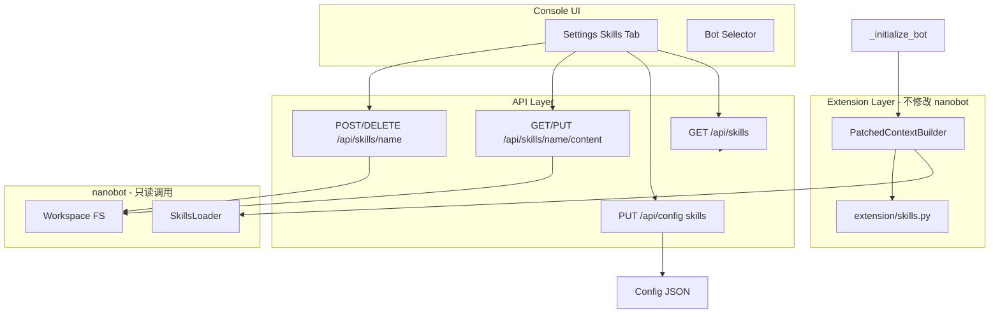

# Bot Skills 管理功能实现计划

## 约束

**不能修改 nanobot/ 目录下的任何代码**。所有扩展通过 `console/server/extension/` 打补丁实现。

## 现状分析

- **Skill 来源**：`builtin`（nanobot/skills/）8 个 + `workspace`（每个 bot 的 workspace/skills/）
- **SkillsLoader**：当前加载所有可用 skill，无 per-bot 启用/禁用
- **Config**：nanobot Config 无 skills 字段，但 config JSON 可存储任意键，Pydantic 会忽略未知字段
- **Settings**：Skills tab 仅有静态说明，无实际功能

## 架构设计

## 实现步骤

### 1. Extension 层：Skills 补丁

**新建文件**: [console/server/extension/skills.py](console/server/extension/skills.py)

- 定义 `PatchedContextBuilder`，继承 `nanobot.agent.context.ContextBuilder`
- 在 `__init__` 中接收 `skills_config: dict`（从 config JSON 的 `skills` 键读取，格式 `{ "clawhub": { "enabled": true } }`）
- 重写 `build_system_prompt`：调用 `self.skills.list_skills(filter_unavailable=False)` 得到全部 skill，按 `skills_config` 过滤掉 `enabled=False` 的，再手动构建 skills_summary 与 always_skills 部分（复用 SkillsLoader 的 `load_skill`、`_get_skill_description` 等）
- 未在 config 中列出的 skill 默认 `enabled=True`（向后兼容）

### 2. main.py 中应用补丁

**文件**: [console/server/main.py](console/server/main.py)

- 在 `_initialize_bot` 中，创建 `AgentLoop` 后，用 `PatchedContextBuilder(workspace, config_dict.get("skills", {}))` 替换 `agent_loop.context`
- `config_dict` 来自 `config.model_dump(by_alias=True)`，需在 dump 后合并从 JSON 直接读取的 `skills` 字段（因 Config 模型不含 skills，model_dump 不会输出它）
- 读取 config 时：`with open(config_path) as f: raw = json.load(f)`，取 `raw.get("skills", {})` 合并进 config_dict

### 3. Config 存储 skills（不修改 nanobot）

- 使用已有 `PUT /api/config`，`section: "skills"`，`data: { "clawhub": { "enabled": false } }`
- `state.update_config` 会更新 `self._config["skills"]` 并写回 JSON 文件
- 需确保 `update_config` 在写入时保留 skills 等非 schema 字段：当前实现是 `self._config[section].update(data)` 然后 `json.dumps(self._config)`，因此会保留已有键，需在初次加载时把 JSON 中的 skills 合并进 `self._config`

**文件**: [console/server/api/state.py](console/server/api/state.py)

- 在 `initialize` 或 `get_config` 时，若从文件加载 config，需用 `json.load` 读原始 JSON，将 `skills` 合并进 `self._config`，确保 skills 不会在加载时丢失

### 4. State 层：确保 skills 正确加载与持久化

**文件**: [console/server/api/state.py](console/server/api/state.py)

- `initialize(config=...)` 时，传入的 config 需包含 `skills` 键
- `update_config(section="skills", data)` 已支持，会更新并写回 JSON
- 在 main.py 的 `_initialize_bot` 中，从 config 文件原始 JSON 读取 `skills` 并合并进 config_dict，再传给 state.initialize

### 5. Console API 新增端点

**文件**: [console/server/api/routes.py](console/server/api/routes.py)

| 端点                           | 方法     | 说明                                                                             |
| ---------------------------- | ------ | ------------------------------------------------------------------------------ |
| `/api/skills`                | GET    | 列出指定 bot 的所有 skill（builtin + workspace），含 name、source、description、enabled、path |
| `/api/config`                | PUT    | 已有，支持 `section: "skills"` 更新 `{ "skillName": { "enabled": true } }`            |
| `/api/skills/{name}/content` | GET    | 获取 skill 内容（workspace 可读，builtin 只读展示）                                         |
| `/api/skills/{name}/content` | PUT    | 更新 skill 内容（仅 workspace 可写）                                                    |
| `/api/skills`                | POST   | 创建 workspace skill（name、description、content）                                   |
| `/api/skills/{name}`         | DELETE | 删除 workspace skill（仅 workspace）                                                |

- 所有端点支持 `bot_id` query 参数
- 实现逻辑放在 extension/skills.py 或 routes 中，通过 `get_state(bot_id)` 获取 workspace，调用 `nanobot.agent.skills.SkillsLoader` 列出 skill

### 6. 前端 API 与类型

**文件**: [console/web/src/api/client.ts](console/web/src/api/client.ts)（或类似）

- 新增 `listSkills(botId?)`、`updateSkillsConfig(botId, data)`、`getSkillContent(botId, name)`、`updateSkillContent(botId, name, content)`、`createSkill(botId, data)`、`deleteSkill(botId, name)`

**文件**: [console/web/src/api/types.ts](console/web/src/api/types.ts)

- 扩展 `SkillConfig`：`enabled?: boolean`
- 新增 `SkillInfo`：`name: string; source: 'builtin' | 'workspace'; description: string; enabled: boolean; path?: string; available?: boolean`

### 7. Settings Skills Tab UI

**文件**: [console/web/src/pages/Settings.tsx](console/web/src/pages/Settings.tsx)

- 使用 `currentBotId` 切换 bot
- 调用 `listSkills` 展示列表，按 source 分组（公共 builtin / 本 bot workspace）
- 每个 skill 卡片：名称、描述、来源标签、启用开关（builtin）、编辑/删除按钮（workspace）
- 编辑：弹窗或内联编辑 SKILL.md 内容，保存调用 `updateSkillContent`
- 删除：确认后调用 `deleteSkill`
- 添加：按钮 + 表单（name、description、初始 content），调用 `createSkill`
- 启用/禁用开关：调用 `updateConfig` section skills，更新后 invalidate 并刷新

### 8. 创建 skill 的目录结构

- 新建 workspace skill 时：在 `workspace/skills/{name}/` 下创建 `SKILL.md`，含 frontmatter（name、description）
- 在 extension 层内联实现，不依赖 nanobot 的 init_skill.py

## 关键文件清单（仅修改 console 层，不修改 nanobot）

| 文件                                   | 修改内容                                                             |
| ------------------------------------ | ---------------------------------------------------------------- |
| `console/server/extension/skills.py` | **新建** PatchedContextBuilder、list_skills_for_bot、skill CRUD 辅助函数 |
| `console/server/main.py`             | 创建 AgentLoop 后替换 context，合并 skills 到 config_dict                 |
| `console/server/api/routes.py`       | 新增 skills 相关 API 端点                                              |
| `console/server/api/state.py`        | 确保 update_config 写入时保留 skills（当前逻辑已支持，需验证）                       |
| `console/web/src/api/types.ts`       | SkillInfo 等类型                                                    |
| `console/web/src/api/client.ts`      | skills API 方法                                                    |
| `console/web/src/pages/Settings.tsx` | Skills tab 完整 UI                                                 |

## 注意事项

- builtin skill 不可编辑/删除，仅可启用/禁用
- workspace skill 可编辑、删除，新建时需校验 name 合法性（避免路径注入）
- 修改 config 或 skill 后，若 bot 正在运行，需重启或热重载才能生效（可先实现重启提示）

