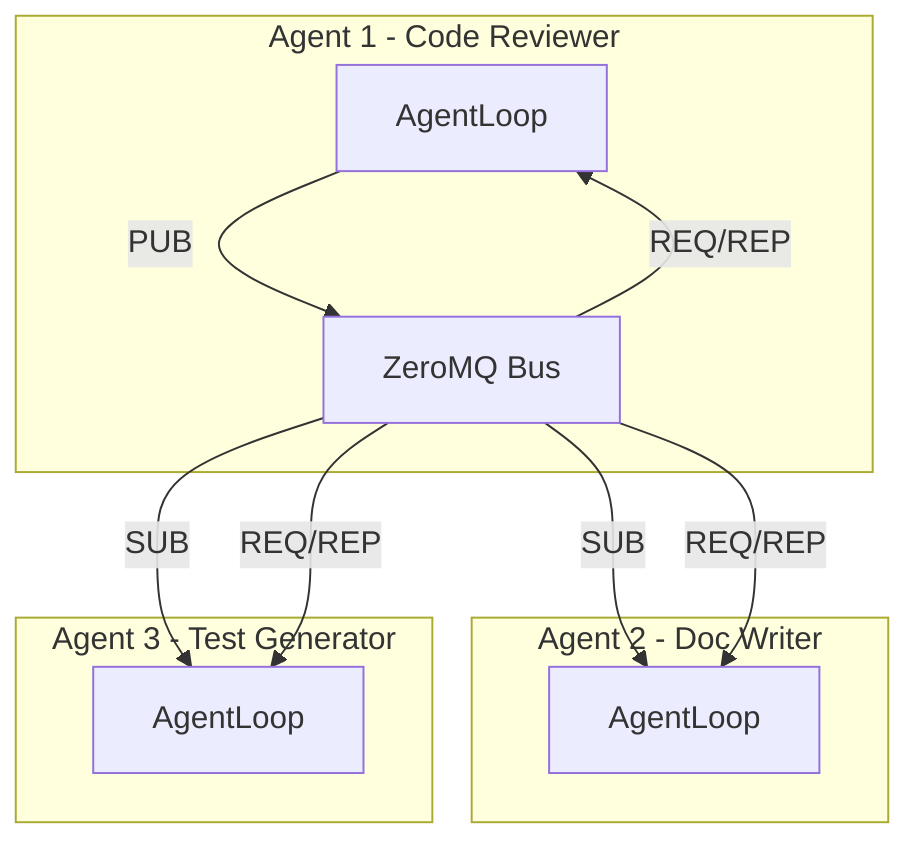

# 多Agent设计方案 (ZeroMQ通信层)

## 需求概述

- **模式**: 单Bot内多Agent (一个Bot有多个Agent协同工作)
- **管理方式**: 通过UI管理
- **交互模式**: 支持独立对话 + 协同工作
- **通信层**: ZeroMQ (基于消息队列的Pub/Sub模式)

---

## 架构设计

```
Bot (现有)
├── Agent 1 (新增: 负责代码审查)
│   └── ZeroMQ SUB socket (订阅: agent.code-reviewer, broadcast)
├── Agent 2 (新增: 负责文档撰写)
│   └── ZeroMQ SUB socket (订阅: agent.doc-writer, broadcast)
├── Agent 3 (新增: 负责测试生成)
│   └── ZeroMQ SUB socket (订阅: agent.test-generator, broadcast)
│
├── ZeroMQ消息总线 (新增)
│   ├── PUB socket (广播消息)
│   └── ROUTER socket (Agent间直接通信)
│
└── 共享资源
    ├── SessionManager (会话共享或隔离)
    ├── ChannelManager
    ├── Workspace
    └── Tools (可按Agent配置)
```

### ZeroMQ通信模式




---

## 数据模型

### 1. Agent配置

**存储位置**: `{bot_workspace}/agents/agents.json`

```json
{
  "agents": [
    {
      "id": "code-reviewer",
      "name": "Code Reviewer",
      "description": "负责代码审查和质量改进",
      "model": null,
      "temperature": 0.1,
      "system_prompt": "你是一个专业的代码审查专家...",
      "skills": ["code", "review"],
      "enabled": true,
      "topics": ["code-changes", "pr-created"],  # 订阅的ZeroMQ主题
      "collaborators": ["doc-writer"]  # 协作Agent列表
    }
  ]
}
```

### 2. ZeroMQ消息格式

```python
@dataclass
class AgentMessage:
    """Agent间通信消息格式"""
    msg_type: str  # "request", "response", "broadcast", "delegate"
    sender_id: str
    receiver_id: str | None  # None表示广播
    topic: str  # 消息主题
    content: str
    context: dict[str, Any]  # 附加上下文
    correlation_id: str  # 用于追踪请求/响应
    timestamp: datetime
```

---

## 后端实现

### 1. ZeroMQ消息总线

**文件**: `console/server/extension/zmq_bus.py` (新建)

```python
import zmq
import asyncio
import json
from dataclasses import dataclass, asdict
from typing import Callable, Any
from loguru import logger


@dataclass
class AgentMessage:
    """Agent间通信消息格式"""
    msg_type: str  # "request", "response", "broadcast", "delegate"
    sender_id: str
    receiver_id: str | None  # None表示广播
    topic: str  # 消息主题
    content: str
    context: dict[str, Any]
    correlation_id: str
    timestamp: str


class ZeroMQBus:
    """基于ZeroMQ的Agent消息总线"""
    
    def __init__(self, bind_addr: str = "tcp://127.0.0.1:5555"):
        self._context = zmq.asyncio.Context()
        self._pub_socket = None
        self._router_socket = None
        self._sub_sockets: dict[str, asyncio.Task] = {}
        self._handlers: dict[str, Callable] = {}
        self._bind_addr = bind_addr
        self._agent_id: str | None = None
        
    async def start_publisher(self) -> None:
        """启动Publisher"""
        self._pub_socket = self._context.socket(zmq.PUB)
        self._pub_socket.bind(self._bind_addr)
        logger.info("ZeroMQ Publisher started at {}", self._bind_addr)
    
    async def start_router(self) -> None:
        """启动Router (用于Agent间直接通信)"""
        self._router_socket = self._context.socket(zmq.ROUTER)
        self._router_socket.bind(f"{self._bind_addr}_router")
        logger.info("ZeroMQ Router started at {}_router", self._bind_addr)
    
    async def subscribe(self, agent_id: str, topics: list[str], handler: Callable) -> None:
        """订阅主题"""
        socket = self._context.socket(zmq.SUB)
        for topic in topics:
            socket.setsockopt(zmq.SUBSCRIBE, topic.encode())
        
        task = asyncio.create_task(self._read_messages(socket, agent_id, handler))
        self._sub_sockets[agent_id] = task
        logger.info("Agent {} subscribed to topics: {}", agent_id, topics)
    
    async def publish(self, topic: str, message: AgentMessage) -> None:
        """发布消息"""
        if self._pub_socket:
            msg_data = json.dumps(asdict(message))
            self._pub_socket.send_string(f"{topic}:{msg_data}")
    
    async def send_direct(self, receiver_id: str, message: AgentMessage) -> None:
        """直接发送消息给特定Agent"""
        if self._router_socket:
            msg_data = json.dumps(asdict(message))
            self._router_socket.send_string(f"{receiver_id}:{msg_data}")
    
    async def broadcast(self, message: AgentMessage) -> None:
        """广播消息给所有Agent"""
        await self.publish("broadcast", message)
    
    async def delegate_task(self, to_agent_id: str, task: str, context: dict) -> str:
        """将任务委托给另一个Agent"""
        correlation_id = uuid.uuid4().hex[:8]
        message = AgentMessage(
            msg_type="delegate",
            sender_id=self._agent_id,
            receiver_id=to_agent_id,
            topic="task_delegation",
            content=task,
            context=context,
            correlation_id=correlation_id,
            timestamp=datetime.now().isoformat()
        )
        await self.send_direct(to_agent_id, message)
        return correlation_id
    
    async def _read_messages(self, socket, agent_id: str, handler: Callable) -> None:
        """读取订阅消息"""
        while True:
            try:
                message = await socket.recv_string()
                topic, data = message.split(":", 1)
                msg_obj = AgentMessage(**json.loads(data))
                await handler(msg_obj)
            except Exception as e:
                logger.error("Error reading message for {}: {}", agent_id, e)
    
    def set_agent_id(self, agent_id: str) -> None:
        self._agent_id = agent_id
```

### 2. AgentStateManager

**文件**: `console/server/extension/agents.py` (新建)

```python
from dataclasses import dataclass, field
from datetime import datetime
from pathlib import Path
from typing import Any
import json
from .zmq_bus import ZeroMQBus, AgentMessage


@dataclass
class AgentConfig:
    """单个Agent配置"""
    id: str
    name: str
    description: str | None = None
    model: str | None = None
    temperature: float | None = None
    system_prompt: str | None = None
    skills: list[str] = field(default_factory=list)
    enabled: bool = True
    topics: list[str] = field(default_factory=list)  # 订阅的主题
    collaborators: list[str] = field(default_factory=list)  # 协作Agent
    created_at: datetime = field(default_factory=datetime.now)
    metadata: dict[str, Any] = field(default_factory=dict)


class AgentManager:
    """管理单个Bot内的多个Agent"""
    
    def __init__(self, bot_id: str, workspace: Path):
        self.bot_id = bot_id
        self.workspace = workspace
        self.agents_dir = workspace / "agents"
        self._zmq_bus = ZeroMQBus()
        self._agents: dict[str, AgentConfig] = {}
        self._agent_loops: dict[str, AgentLoop] = {}  # 每个Agent的AgentLoop
        
    async def initialize(self) -> None:
        """初始化Agent系统"""
        self.agents_dir.mkdir(exist_ok=True)
        await self._zmq_bus.start_publisher()
        await self._zmq_bus.start_router()
        await self._load_agents()
        
    async def _load_agents(self) -> None:
        """加载Agent配置"""
        config_file = self.agents_dir / "agents.json"
        if config_file.exists():
            data = json.loads(config_file.read_text())
            for agent_data in data.get("agents", []):
                agent = AgentConfig(**agent_data)
                self._agents[agent.id] = agent
                
                # 订阅ZeroMQ主题
                if agent.enabled and agent.topics:
                    await self._zmq_bus.subscribe(
                        agent.id, 
                        agent.topics, 
                        self._create_handler(agent.id)
                    )
    
    def _create_handler(self, agent_id: str) -> callable:
        """创建Agent消息处理器"""
        async def handle_message(msg: AgentMessage):
            if msg.msg_type == "delegate":
                # 处理委托任务
                await self._handle_delegation(agent_id, msg)
            elif msg.msg_type == "broadcast":
                # 处理广播消息
                await self._handle_broadcast(agent_id, msg)
        return handle_message
    
    async def _handle_delegation(self, agent_id: str, msg: AgentMessage) -> None:
        """处理任务委托"""
        logger.info("Agent {} received delegation from {}: {}", 
                   agent_id, msg.sender_id, msg.content[:50])
        # 将消息注入到AgentLoop的处理队列
    
    async def _handle_broadcast(self, agent_id: str, msg: AgentMessage) -> None:
        """处理广播消息"""
        pass
    
    async def create_agent(self, config: AgentConfig) -> AgentConfig:
        """创建新Agent"""
        self._agents[config.id] = config
        await self._save_agents()
        
        if config.enabled and config.topics:
            await self._zmq_bus.subscribe(
                config.id, 
                config.topics, 
                self._create_handler(config.id)
            )
        return config
    
    async def delegate_task(self, from_agent: str, to_agent: str, task: str, context: dict) -> str:
        """委托任务给另一个Agent"""
        return await self._zmq_bus.delegate_task(to_agent, task, context)
    
    async def broadcast_event(self, agent_id: str, topic: str, content: str, context: dict) -> None:
        """广播事件给所有Agent"""
        msg = AgentMessage(
            msg_type="broadcast",
            sender_id=agent_id,
            receiver_id=None,
            topic=topic,
            content=content,
            context=context,
            correlation_id=uuid.uuid4().hex[:8],
            timestamp=datetime.now().isoformat()
        )
        await self._zmq_bus.broadcast(msg)
```

### 3. API端点扩展

**文件**: `console/server/api/routes.py` (修改)


| 端点                                              | 方法     | 功能         |
| ----------------------------------------------- | ------ | ---------- |
| `/api/bots/{bot_id}/agents`                     | GET    | 列出所有Agent  |
| `/api/bots/{bot_id}/agents`                     | POST   | 创建新Agent   |
| `/api/bots/{bot_id}/agents/{agent_id}`          | GET    | 获取Agent详情  |
| `/api/bots/{bot_id}/agents/{agent_id}`          | PUT    | 更新Agent配置  |
| `/api/bots/{bot_id}/agents/{agent_id}`          | DELETE | 删除Agent    |
| `/api/bots/{bot_id}/agents/{agent_id}/delegate` | POST   | 委托任务给Agent |


---

## 前端实现

### 1. Agent列表页面

**文件**: `console/web/src/pages/Agents.tsx` (新建)

- 显示当前Bot的所有Agent卡片
- 创建/编辑/删除Agent
- 启用/禁用Agent开关
- Agent状态指示 (运行中/空闲)
- 协作关系可视化

### 2. Agent详情页面

**文件**: `console/web/src/pages/AgentDetail.tsx` (新建)

- 基本信息编辑 (名称、描述)
- 模型和温度配置
- System Prompt编辑器
- 订阅主题配置 (ZeroMQ topics)
- 协作Agent选择
- 实时测试面板

### 3. Chat页面扩展

**文件**: `console/web/src/pages/Chat.tsx` (修改)

- Agent选择器下拉菜单
- @提及切换Agent
- 显示当前Agent状态
- 任务委托按钮

### 4. 消息/事件流

```typescript
// WebSocket新增事件
interface AgentEvent {
  type: 'agent_status' | 'agent_message' | 'task_delegated';
  agent_id: string;
  data: any;
}
```

---

## Agent协作场景

### 场景1: 代码审查后自动生成文档

```
User --> Agent:CodeReviewer (提交PR)
Agent:CodeReviewer --> ZeroMQ:broadcast (code-reviewed)
Agent:DocWriter --> ZeroMQ:sub (收到code-reviewed)
Agent:DocWriter --> 生成API文档
Agent:DocWriter --> ZeroMQ:delegate (doc-generated)
Agent:CodeReviewer --> 通知用户
```

### 场景2: 任务委托

```
User --> Agent (任何Agent)
Agent:Any --> AgentManager.delegate_task("test-generator", task, context)
Agent:test-generator --> 执行测试生成
Agent:test-generator --> 返回结果
Agent:Any --> 返回给用户
```

---

## 依赖

需要在 `pyproject.toml` 添加:

```toml
dependencies = [
    # ... existing
    "pyzmq>=26.0.0,<27.0.0",
]
```

---

## 实现步骤

### Phase 1: 基础设施

1. 添加 `pyzmq` 依赖
2. 创建 `console/server/extension/zmq_bus.py` - ZeroMQ消息总线
3. 创建 `console/server/extension/agents.py` - Agent管理器

### Phase 2: API层

1. 添加Agent CRUD API端点
2. 添加任务委托API

### Phase 3: 前端

1. 创建Agents列表页面
2. 创建Agent详情页面
3. Chat页面Agent选择器
4. API客户端扩展

### Phase 4: 协作功能

1. Agent智能路由
2. 协作工作流
3. 监控面板

---

## 关键文件清单


| 文件                                      | 操作                  |
| --------------------------------------- | ------------------- |
| `pyproject.toml`                        | 修改 - 添加pyzmq        |
| `console/server/extension/zmq_bus.py`   | 新建 - ZeroMQ消息总线     |
| `console/server/extension/agents.py`    | 新建 - Agent管理器       |
| `console/server/api/routes.py`          | 修改 - Agent API      |
| `console/server/api/state.py`           | 修改 - 集成AgentManager |
| `console/server/api/websocket.py`       | 修改 - Agent事件        |
| `console/web/src/pages/Agents.tsx`      | 新建                  |
| `console/web/src/pages/AgentDetail.tsx` | 新建                  |
| `console/web/src/pages/Chat.tsx`        | 修改                  |
| `console/web/src/api/client.ts`         | 修改                  |
| `console/web/src/store/index.ts`        | 修改                  |


