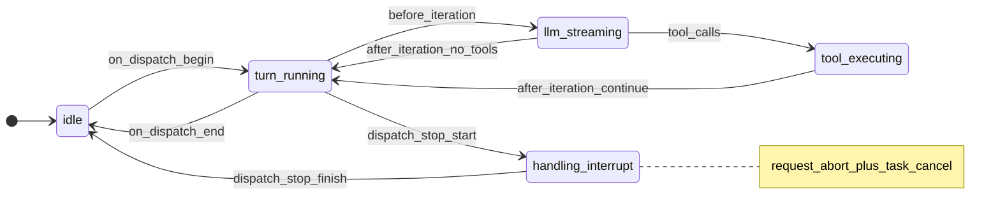
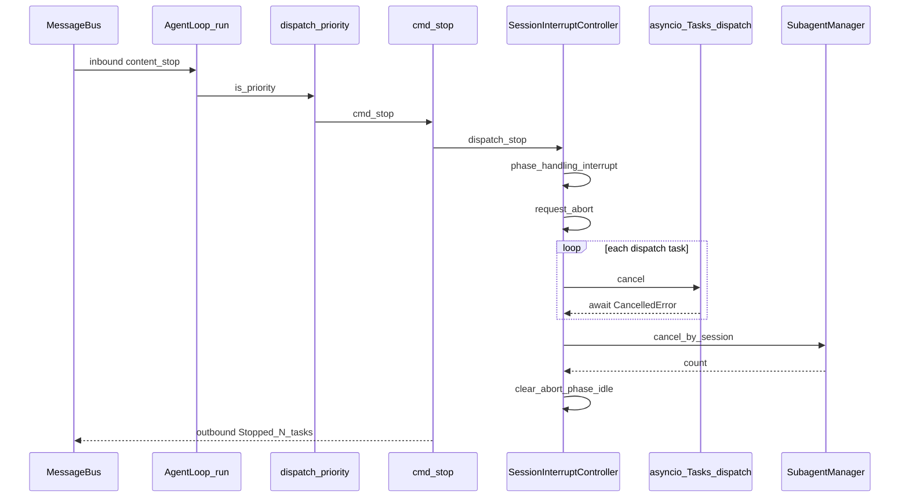
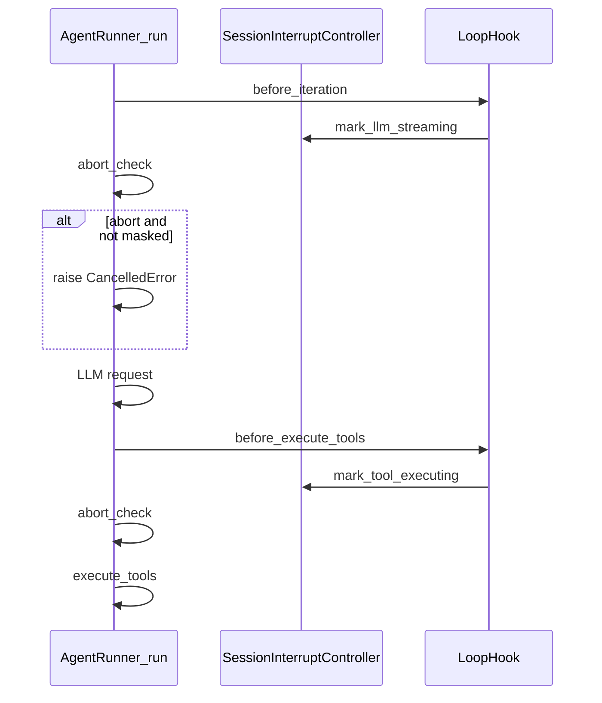
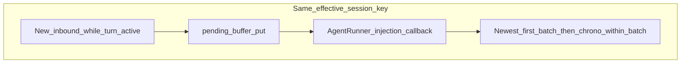
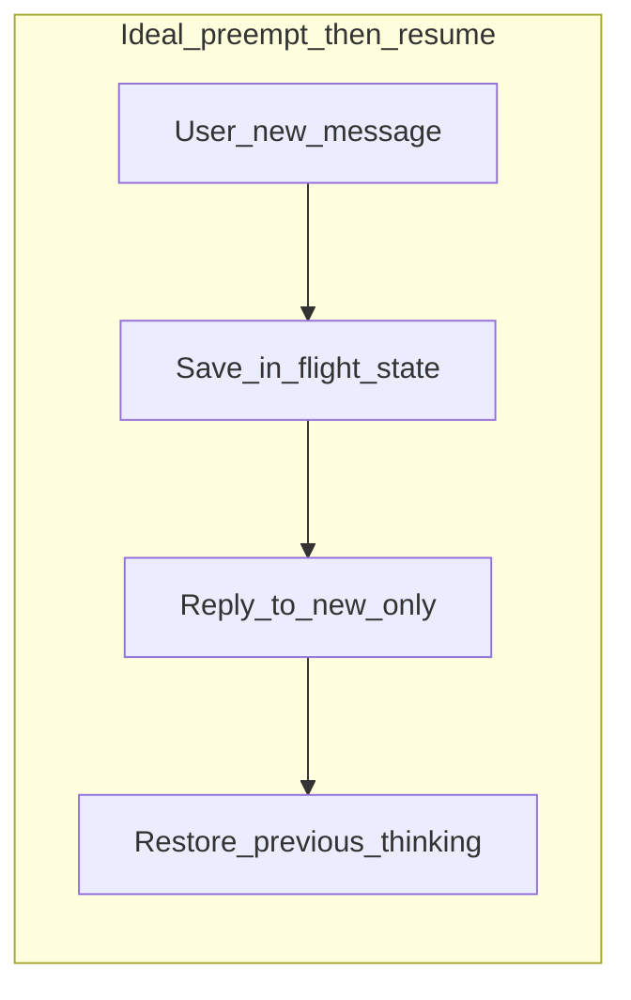
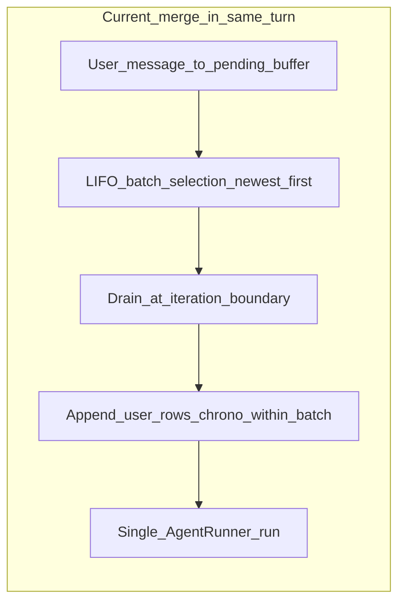

# Agent 会话状态机与中断式停止（运作原理）

本文说明 nanobot 中与「类 CPU 中断」相关的运行时模型：**会话级执行相位**、**协作式中止**、**关中断临界区**、**记忆子系统相位**以及与 [MEMORY.md](MEMORY.md) 中分层记忆的关系。

实现入口：

- 控制面：[`nanobot/agent/interrupts.py`](../nanobot/agent/interrupts.py) 中的 `SessionInterruptController`
- 接线：[`nanobot/agent/loop.py`](../nanobot/agent/loop.py) 中的 `AgentLoop`、`_LoopHook`
- 轮次内协作退出：[`nanobot/agent/runner.py`](../nanobot/agent/runner.py) 中 `AgentRunSpec.abort_check`
- 停止命令：[`nanobot/command/builtin.py`](../nanobot/command/builtin.py) 中的 `cmd_stop`
- WebSocket 结构化停止：[`nanobot/channels/websocket.py`](../nanobot/channels/websocket.py) 中的 `_parse_inbound_payload`

---

## 中断流程与状态（Mermaid）

### 会话执行相位（状态机）

下列状态对应 `ExecutionPhase`；`on_dispatch_begin` / `on_dispatch_end` 包裹整段 `_dispatch`，`_LoopHook` 在单次 `AgentRunner.run` 的多轮迭代内更新子相位。



### 硬中断：`/stop` 与 priority 路径（时序）

`/stop`、WebSocket `type: interrupt|stop` 解析结果均走 **priority**，不等待 `session_lock`。`dispatch_stop` 置协作 abort、取消 `_dispatch` 任务，并取消该会话子代理。



### 协作式中止与 Runner（时序）

`abort_check` 在每轮迭代开始与工具执行前轮询；与 `interrupt_mask` 同时为真时不触发中止（临界区内）。



### 软中断：同会话 follow-up（流程）

不调用 `dispatch_stop`；消息进入 `PendingFollowupBuffer`，由 `injection_callback` 在迭代边界并入上下文；**每次 drain 优先取最新 backlog**。



---

## 1. 设计目标

在**不推翻**既有机制的前提下，用显式状态把下列行为串起来：

| 既有机制 | 在 FSM/中断模型中的角色 |
|----------|-------------------------|
| `AgentLoop.run()` 优先处理 **priority** 命令（如 `/stop`） | 高优先级「中断」，不经过会话锁排队 |
| `_active_tasks` + `task.cancel()` | 硬停止：向 asyncio 任务注入取消 |
| `_pending_queues` + `PendingFollowupBuffer` 同会话中途注入 | 软中断：不取消当前轮；注入批次**优先取最新 backlog** |
| `runtime_checkpoint` / 恢复 | 崩溃或异常后的会话一致性；与停止路径共用部分持久化概念 |
| `maybe_consolidate_by_tokens`、Dream | 记忆子系统工作；可与「主轮次」在策略上错开 |

---

## 2. 会话执行相位（ExecutionPhase）

对每个 **effective `session_key`**（含 unified 模式下的 `unified:default`）维护一个粗粒度相位，枚举见 `ExecutionPhase`：

| 相位 | 含义 |
|------|------|
| `idle` | 当前无该 key 的 `_dispatch` 在跑 |
| `turn_running` | 已进入 `_dispatch` 的锁内，一轮对话处理中（含多轮 LLM↔工具迭代时的「回合间」） |
| `llm_streaming` | `AgentRunner` 即将或正在发起本轮 LLM 请求（`before_iteration`） |
| `tool_executing` | 即将或正在执行本轮工具调用（`before_execute_tools`） |
| `handling_interrupt` | 正在处理停止请求（`dispatch_stop` 内短暂标记） |

**迁移关系（简化）：**

- `_dispatch` 进入 `async with lock` 后调用 `on_dispatch_begin` → `turn_running`，并增加全局「在途 dispatch 计数」。
- `_LoopHook`：每轮迭代开始 → `llm_streaming`；执行工具前 → `tool_executing`；`after_iteration` → 回到 `turn_running`。
- `_dispatch` 结束（含取消）在 `finally` 中调用 `on_dispatch_end` → `idle`，清除该会话的 abort 标志，减少在途计数。

---

## 3. 停止路径：/stop 与 `dispatch_stop`

### 3.1 为何能「插队」

主循环 [`AgentLoop.run()`](../nanobot/agent/loop.py) 在把消息交给 `_dispatch` 之前，若内容匹配 **priority** 命令（如 `/stop`），直接 `dispatch_priority`，**不**与正在处理同会话的 `_dispatch` 抢同一把 `session_lock`。

### 3.2 `cmd_stop` 做什么

1. 用 **`_effective_session_key(msg)`** 解析 key（unified 模式下与 `_active_tasks` 中登记的任务 key 一致）。
2. 从 `loop._active_tasks` **弹出**该 key 对应的 asyncio 任务列表。
3. 调用 **`interrupt_controller.dispatch_stop(session_key, tasks, cancel_subagents)`**：
   - 将相位标为 `handling_interrupt`；
   - **`request_abort`**：置位该会话的协作中止标志（见下节）；
   - 对每个任务 **`cancel()`** 并 **`await`**，吞掉取消异常；
   - **`await cancel_by_session(session_key)`** 取消子代理任务；
   - 最后 **`clear_abort`** 并将相位置回 **`idle`**（与真实 `_dispatch` 的 `on_dispatch_end` 互补；测试里伪造的任务不会走 `_dispatch`，此处保证状态落稳）。

**主停止手段仍是 `task.cancel()`**；协作标志用于在 `AgentRunner` 循环边界尽快退出（见 §4）。

---

## 4. 协作式中止（`abort_check`）

`SessionInterruptController` 为每个会话维护一个 **`asyncio.Event`**：`request_abort` 时 `set`，`on_dispatch_begin` / `on_dispatch_end` / `dispatch_stop` 末尾会 `clear`。

构建 `AgentRunSpec` 时，若存在 `session`，则传入：

```text
abort_check: 若未处于 interrupt_mask 且 abort 事件已 set → True
```

[`AgentRunner.run()`](../nanobot/agent/runner.py) 在：

- **每一轮 `max_iterations` 迭代开始**；
- **工具执行前**（`before_execute_tools` 之后、`_execute_tools` 之前）；

若 `abort_check()` 为真，则 **`raise asyncio.CancelledError()`**，使运行栈与「任务取消」路径对齐。

**局限（已知）：** 若阻塞在单次 LLM HTTP/SSE 流内部，须等该 `await` 结束或任务被整体 cancel 才能走出；**主动断开 provider 流**属于后续阶段工作，不在当前实现范围。

---

## 5. 关中断：临界区（`interrupt_mask`）

写 **runtime checkpoint** 时，在 `async with interrupt_controller.interrupt_mask(session.key)` 内调用 `_set_runtime_checkpoint`。

含义：

- 提高 **`interrupts_masked(session_key)`** 嵌套深度；
- 与 `abort_check` 组合：**屏蔽期间不认为应协作中止**（避免 checkpoint 与中止判定竞态）。

语义上对应 CPU 的 **CLI（关中断）/ STI（开中断）**：临界区短、可嵌套。

---

## 6. 软中断：同会话中途消息（pending 缓冲）

同一会话已有在途 `_dispatch` 时，新消息不新建任务，而是进入 **`_pending_queues[session_key]`**（[`PendingFollowupBuffer`](../nanobot/agent/pending_followup.py)），由 `AgentRunner` 的 **`injection_callback`** 在迭代边界拉取并合并进对话。

**注入顺序（已实现）：** 每次从缓冲中取出最多 `_MAX_INJECTIONS_PER_TURN` 条时，优先取**时间上最新**的 backlog（从缓冲**右侧**弹出），再在批内按**时间正序**交给模型，使「刚发的消息」更早进入上下文。缓冲满（默认 20 条）时行为与原先一致：`put_nowait` 失败则回退为向总线投递新任务。`_dispatch` 结束时，剩余消息按**时间正序**重新 `publish_inbound`。

这**不会**触发 `dispatch_stop`，相位仍可在 `llm_streaming` / `tool_executing` / `turn_running` 之间变化；枚举 `InterruptKind.FOLLOWUP` 为后续扩展预留。

### 6.1 「思考中被插队 → 先处理新消息 → 再恢复先前思考」

一种常见的**产品期望**是：bot 正在推理或调用工具时，用户又发一条消息，应像 **高优先级中断** 一样：**先**专门答复这条新消息，**再**回到被打断前的推理状态继续执行。

#### 与「完全抢占-恢复」模型的差异（重要）

| 维度 | 理想模型（你描述的） | 当前 nanobot |
|------|----------------------|--------------|
| 是否打断当前 LLM 调用 | 尽快挂起「当前思考」，优先新输入 | **不会**因新用户消息而打断正在进行的单次 `chat`/`chat_stream`；须等该次 `await` 结束，或在迭代边界协作检查生效 |
| 新消息的顺序 | 往往希望**最后一条优先**（类似 LIFO） | **已实现**：pending 在**注入**时按「**最新 backlog 优先**」成批取出（批内仍时间正序）；与旧版 FIFO 整段取出不同 |
| 「恢复先前思考」 | 保存独立上下文栈，处理完插队再恢复 | **仍无**独立「思考栈」；注入内容作为**同一次** `AgentRunner.run` 里追加的 `user` 消息，模型在**同一段对话 transcript** 上继续多轮迭代，由模型自行权衡先后任务 |
| 与 `/stop` 的区别 | 不是终止整轮 | `/stop` 会 **cancel** 任务；插队消息走的是 **pending 注入**，不 cancel |

换言之：**当前行为仍是「软合并」而非「硬抢占 + 显式恢复栈」**，但在 backlog 较多时，**较新的用户句会优先进入下一轮注入批次**。在**下一轮迭代或工具间隙**，模型会看到新内容；**不保证**「先完整答完插队句再自动续写原先未完成的工具链」这一严格语义。

#### 理想流程 vs 当前流程（Mermaid）

下面左图为**期望的抢占-恢复**（概念上）；右图为**当前**数据流（单轮 `run` 内注入）。





#### 若将来要进一步贴近「优先处理插队再恢复」，可能方向（非承诺）

1. **更强抢占**：对带特定 metadata 的入站消息执行 **cancel 当前 `_dispatch` + 持久化 checkpoint**，再单独 `publish_inbound` 插队消息，最后把「续跑」作为新任务入队（复杂度高，需与 session 历史、checkpoint 语义严格对齐）。
2. **流式阶段**：在 provider 侧支持 **中止当前流** 后再处理新消息（参见本文 §4 关于 HTTP/SSE 的局限）。

当前文档与实现以 **§6 软中断 + §3 硬停止** 为准；本节澄清**完全抢占-恢复**与**当前软合并 + 新消息优先注入**的差异，避免与 **priority 命令**（`/stop`）混淆——**用户自然语言插队**默认**不是** `/stop`。

---

## 7. 记忆子系统相位与 Dream 推迟

### 7.1 `MemorySubsystemPhase`

控制器上另有 **`memory_phase`**：`idle` / `consolidating` / `dreaming`。

- 所有 **`maybe_consolidate_by_tokens`**（含同步 `await` 与 `_schedule_background` 尾部）经 **`_consolidate_tracked`** 包裹：进入前后分别 `begin_memory_consolidating` / `end_memory_consolidating`。
- **`/dream`** 与 **gateway 定时 Dream** 在真正 `dream.run()` 前后：`begin_dreaming` / `end_dreaming`。

### 7.2 `defer_dream_when_agent_turn_active`

配置项（`AgentDefaults`，JSON 可用 `deferDreamWhenAgentTurnActive`）：

- **`true`（默认）**：若 **`interrupt_controller.any_turn_active()`**（本进程内至少有一个会话的 `_dispatch` 未结束），则 **不启动** Dream，并返回/记录「推迟」类说明。
- **`false`**：不据此推迟 Dream（仍应注意与业务上「同 workspace 文件」的并发风险）。

**说明：** 轮次结束后的 **`_schedule_background(_consolidate_tracked)`** 通常在 `on_dispatch_end` 之后调度，与「主轮次仍在跑」一般不重叠；与 [AutoCompact](MEMORY.md) 的 idle 归档、`run()` 里传入的 `active_session_keys` 等机制共同减少叠压。

---

## 8. WebSocket 与 `/stop` 等价帧

JSON 帧若含 **`"type": "interrupt"`** 或 **`"stop"`**（大小写不敏感），解析结果为字符串 **`"/stop"`**，后续与手动输入 `/stop` 一样走 **priority** 路径。

---

## 9. 与崩溃恢复（checkpoint）的关系

- **停止**：优先依赖 **cancel + 协作退出**；会话历史与 checkpoint 的清理仍遵循现有 `_process_message` / `_save_turn` 逻辑及 [test_loop_save_turn](../tests/agent/test_loop_save_turn.py) 所覆盖的行为。
- **崩溃恢复**：仍由 `runtime_checkpoint` / `pending_user_turn` 等元数据驱动；本文不重复 [MEMORY.md](MEMORY.md) 全文，仅强调 **interrupt_mask** 用于降低 checkpoint 写入与中止判定的竞态。

---

## 10. 相关配置速查

| 配置 | 含义 |
|------|------|
| `agents.defaults.deferDreamWhenAgentTurnActive` | 任意 agent 轮次在途时是否推迟 Dream |

---

## 11. 术语对照（CPU 类比）

| CPU 概念 | nanobot 中的对应 |
|----------|------------------|
| 中断优先级 | priority 命令 vs 普通入队 vs pending 注入 |
| ISR 上半部 | `dispatch_stop`：置 abort、cancel、await、取消子代理 |
| 下半部 / 软中断 | `_dispatch` 的 `finally` 将 pending 重新 `publish_inbound` |
| 关中断 | `interrupt_mask` 包裹 checkpoint 写入 |
| RETI | `on_dispatch_end` / `dispatch_stop` 末尾清除 abort 与相位 |

此文描述的是**当前源码行为**；若实现变更，请以代码为准。
