# Nanobot 后端管理层设计方案

> 设计原则：nanobot 核心不可修改，前端功能不变，后端通过扩展机制与 nanobot 交互
>
> **核心约束：严格保持各层独立性，Gateway 层不受后端管理层影响**

---

## 目录

1. [设计背景与核心约束](#1-设计背景与核心约束)
2. [层间隔离架构](#2-层间隔离架构)
3. [Gateway 层独立性](#3-gateway-层独立性)
4. [核心组件设计](#4-核心组件设计)
5. [数据流设计](#5-数据流设计)
6. [API 设计](#6-api-设计)
7. [配置管理](#7-配置管理)
8. [改造实施计划](#8-改造实施计划)

---

## 1. 设计背景与核心约束

### 1.1 设计目标

| 目标 | 约束级别 | 说明 |
|------|----------|------|
| nanobot 核心独立 | **硬约束** | `nanobot/` 目录源码绝对不可修改 |
| 前端功能不变 | **硬约束** | 现有 API 接口 100% 兼容，无需前端改动 |
| Gateway 层独立 | **硬约束** | nanobot Gateway 通信不受后端管理层影响 |
| 后端可演进 | **软约束** | 后端管理层可独立重构和扩展 |

### 1.2 当前问题

| 问题 | 影响范围 | 严重性 |
|------|----------|--------|
| 状态分散 | 后端内部 | 中 |
| API 碎片化 | 后端内部 | 中 |
| 配置耦合 | 后端 + nanobot | 高 |
| Gateway 依赖后端状态 | Gateway + 后端 | 高 |
| nanobot 直接调用 | nanobot | 严重 |

### 1.3 核心约束：层间隔离原则

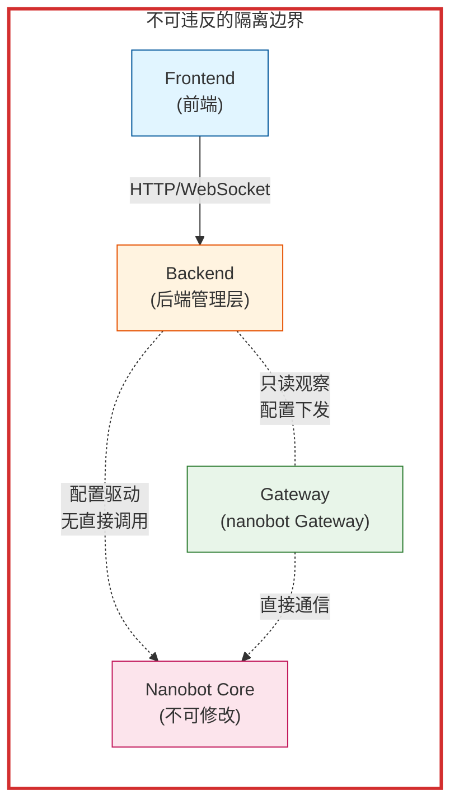

### 1.4 依赖方向约束

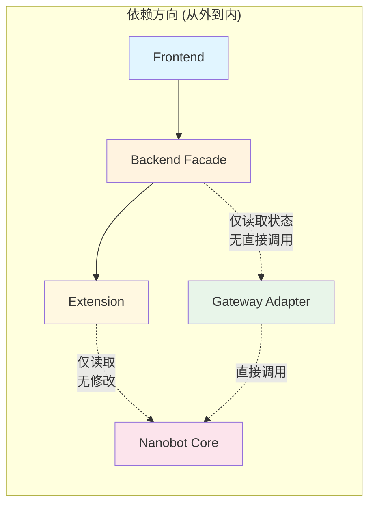

---

## 2. 层间隔离架构

### 2.1 六层架构模型

```mermaid
flowchart TB
    subgraph L1["第一层：前端层 (Frontend)"]
        UI["页面组件"]
        Store["状态管理"]
        WSClient["WebSocket 客户端"]
    end
    
    subgraph L2["第二层：API 网关层 (API Gateway)"]
        Router["路由分发"]
        Auth["认证/鉴权"]
        Validator["请求验证"]
        RateLimit["限流"]
    end
    
    subgraph L3["第三层：后端管理层 (Management Facade)"]
        StateFacade["StateFacade<br/>统一状态"]
        
        subgraph Facades["业务管理器"]
            AgentF["AgentFacade"]
            ChannelF["ChannelFacade"]
            SessionF["SessionFacade"]
            CronF["CronFacade"]
        end
        
        StateFacade --> Facades
    end
    
    subgraph L4["第四层：扩展层 (Extension)"]
        ConfigBridge["配置桥接"]
        EventBridge["事件桥接"]
        Patched["补丁组件"]
    end
    
    subgraph L5["第五层：Gateway 适配层 (Gateway Adapter)"]
        GatewayBridge["Gateway 适配器"]
        GatewayState["Gateway 状态"
        GatewayConfig["配置下发"]
    end
    
    subgraph L6["第六层：nanobot 核心 (Nanobot Core) - 不可修改"]
        AgentLoop["AgentLoop"]
        ChannelMgr["ChannelManager"]
        SessionMgr["SessionManager"]
        Gateway["Gateway"]
        ConfigCore["Config"]
    end
    
    L1 --> L2
    L2 --> L3
    L3 --> L4
    L4 -.->|"仅读配置<br/>无直接调用"| L6
    L5 -.->|"直接通信"| L6
    L3 -.->|"只读观察"| L5
    
    L1 fill:#e1f5ff
    L2 fill:#e3f2fd
    L3 fill:#fff3e0
    L4 fill:#fff8e1
    L5 fill:#e8f5e9
    L6 fill:#fce4ec
```

### 2.2 层间通信协议

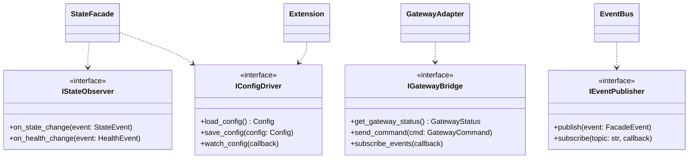

### 2.3 目录结构

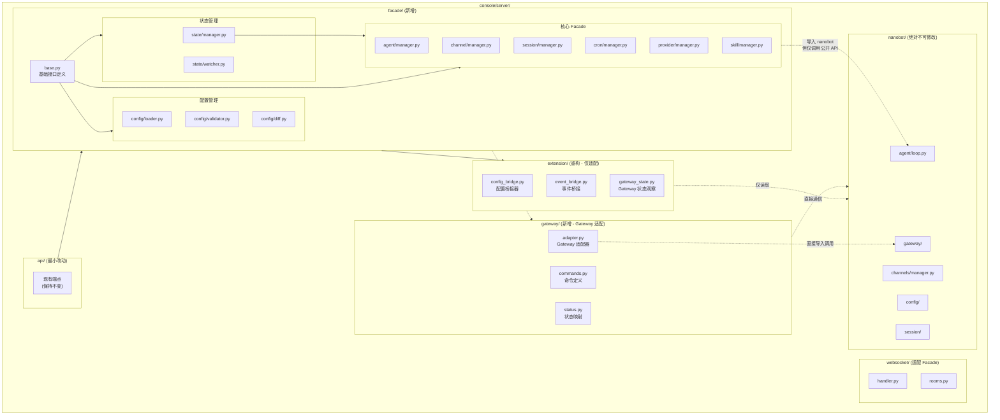

---

## 3. Gateway 层独立性

### 3.1 Gateway 核心地位

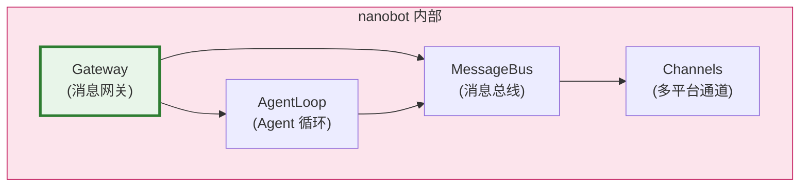

### 3.2 Gateway 隔离策略

```mermaid
flowchart TB
    subgraph Before["重构前 (问题)"]
        B1["后端直接操作 Gateway 状态"]
        B2["后端直接调用 Gateway 方法"]
        B3["Gateway 依赖后端状态"]
    end
    
    subgraph After["重构后 (隔离)"]
        A1["Gateway 完全自主运行"]
        A2["后端仅通过配置影响 Gateway"]
        A3["后端仅观察 Gateway 状态"]
    end
    
    B1 & B2 & B3 -.x."有问题".-> A1 & A2 & A3
```

### 3.3 Gateway 适配器设计

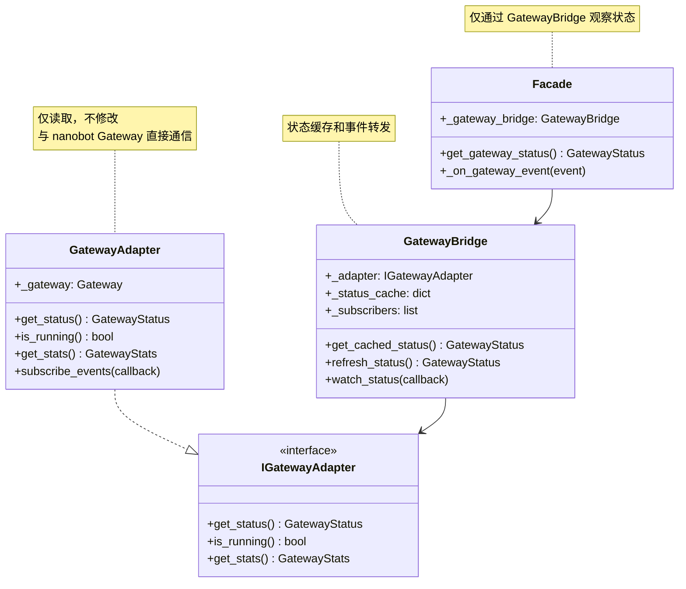

### 3.4 Gateway 事件订阅

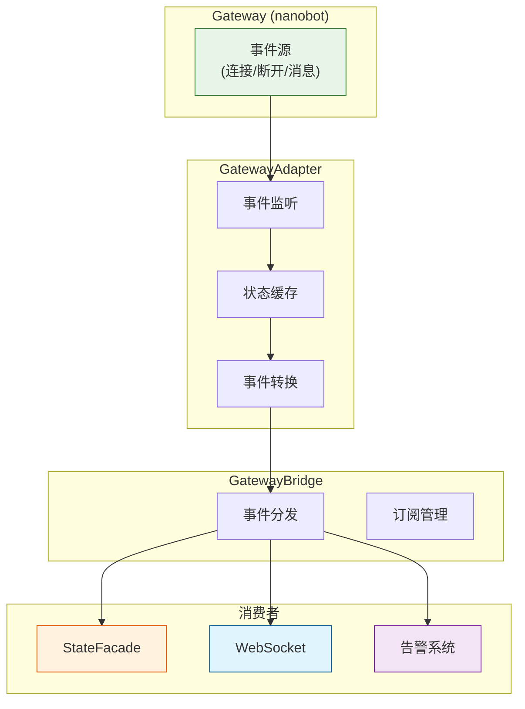

---

## 4. 核心组件设计

### 4.1 后端管理层组件

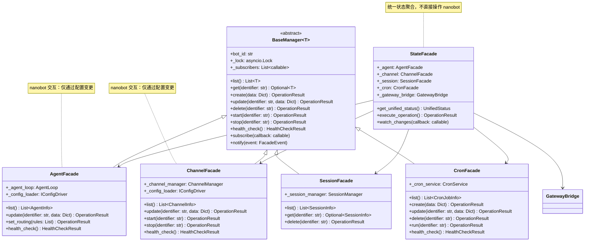

### 4.2 配置驱动交互

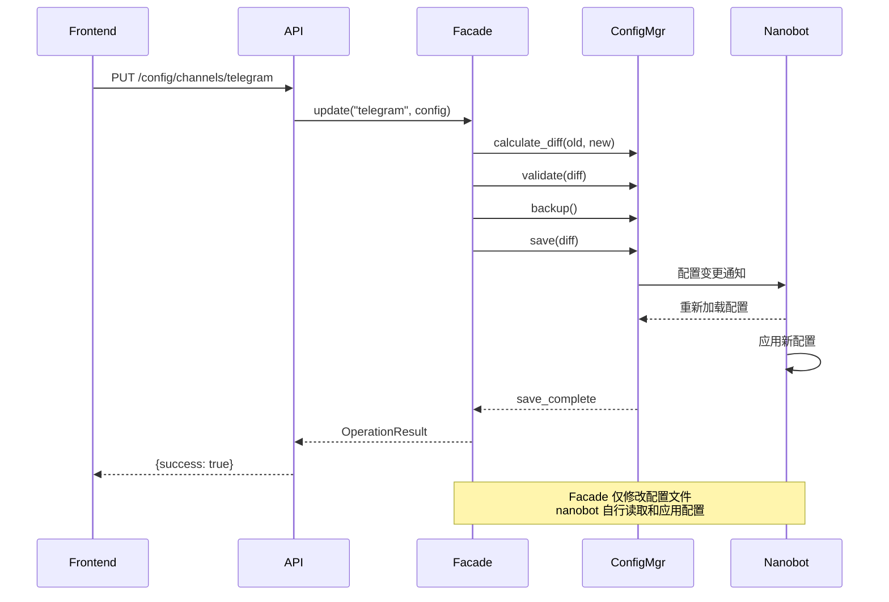

### 4.3 扩展层职责

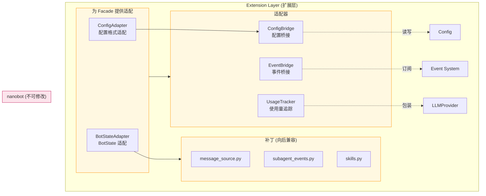

---

## 5. 数据流设计

### 5.1 状态变更数据流

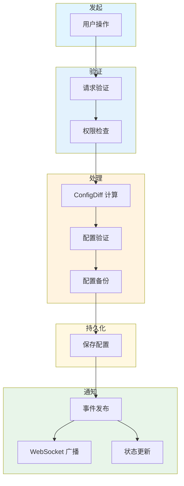

### 5.2 状态同步数据流

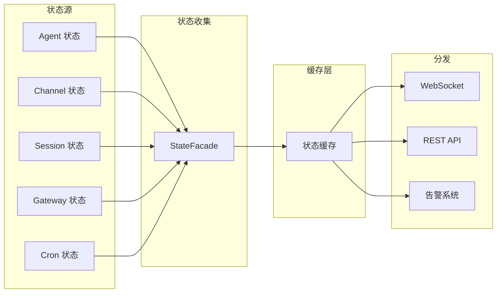

### 5.3 统一状态获取流程

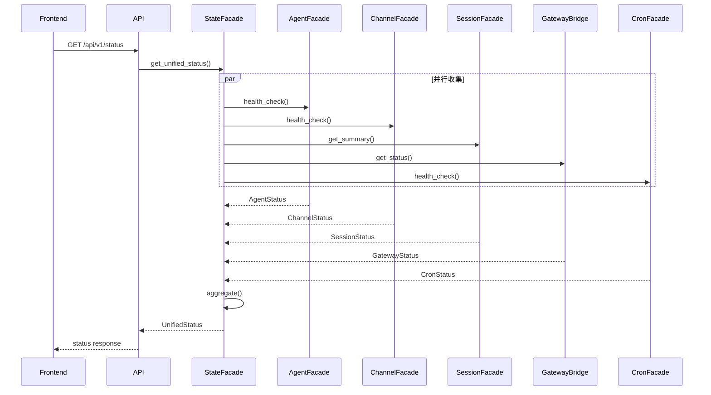

---

## 6. API 设计

### 6.1 API 分层

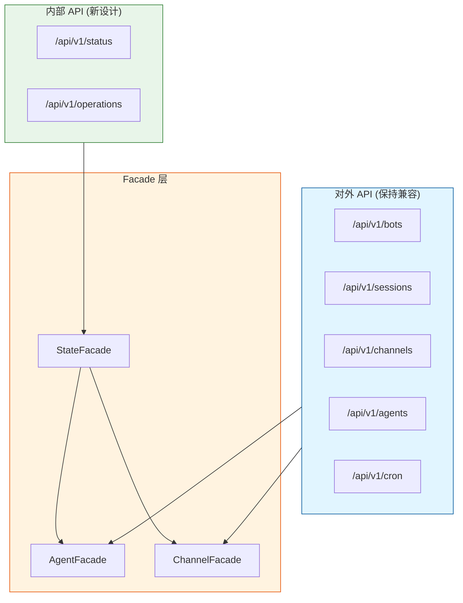

### 6.2 操作请求格式

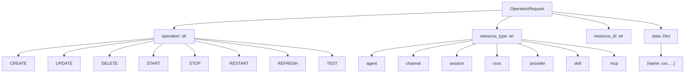

### 6.3 响应格式

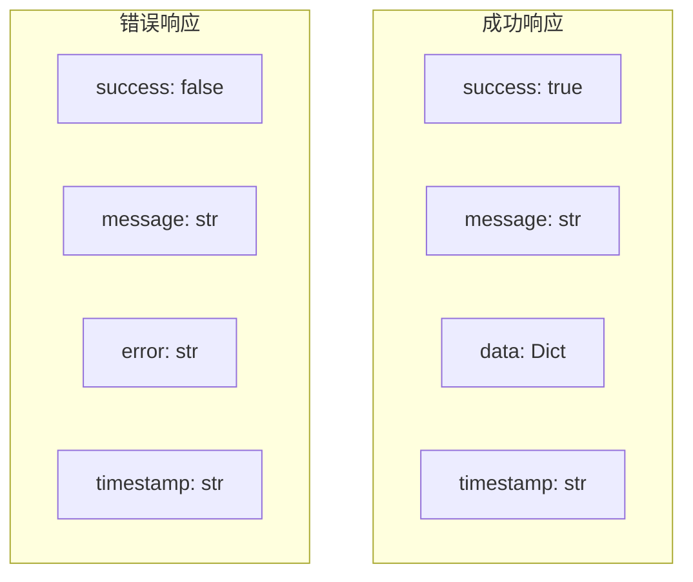

---

## 7. 配置管理

### 7.1 配置管理架构

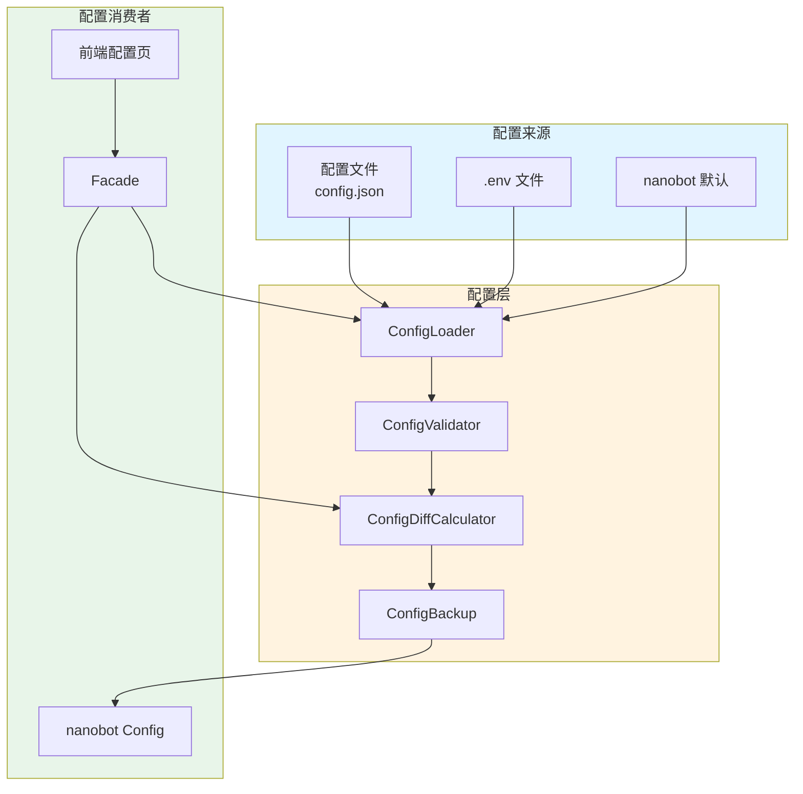

### 7.2 配置变更验证

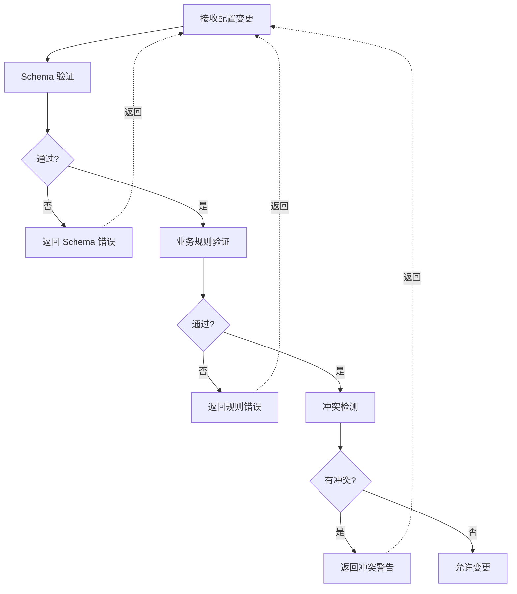

---

## 8. 改造实施计划

### 8.1 阶段划分

```mermaid
gantt
    title 改造实施计划
    dateFormat  YYYY-MM-DD
    
    section Phase 1: 基础设施
    创建基础接口定义         :a1, 2026-03-30, 1 week
    创建配置管理层           :a2, 2026-04-06, 1 week
    
    section Phase 2: Gateway 适配
    创建 Gateway 适配器       :b1, 2026-04-13, 1 week
    实现 Gateway 状态观察     :b2, 2026-04-20, 1 week
    
    section Phase 3: 核心 Facade
    Agent/Channel Facade     :c1, 2026-04-27, 1 week
    Session/Cron Facade      :c2, 2026-05-04, 1 week
    
    section Phase 4: 状态整合
    StateFacade 实现         :d1, 2026-05-11, 1 week
    API 层适配               :d2, 2026-05-18, 1 week
    
    section Phase 5: 验证与优化
    兼容性验证               :e1, 2026-05-25, 1 week
    性能优化                 :e2, 2026-06-01, 1 week
```

### 8.2 各阶段交付物

#### Phase 1: 基础设施

| 交付物 | 文件 | 说明 |
|--------|------|------|
| 基础接口 | `facade/base.py` | BaseManager、OperationResult、HealthCheckResult |
| 配置加载 | `facade/config/loader.py` | 统一配置加载接口 |
| 配置验证 | `facade/config/validator.py` | 配置验证规则 |

#### Phase 2: Gateway 适配

| 交付物 | 文件 | 说明 |
|--------|------|------|
| Gateway 适配器 | `gateway/adapter.py` | IGatewayAdapter 实现 |
| Gateway 桥接 | `extension/gateway_bridge.py` | GatewayBridge 实现 |
| 事件订阅 | `gateway/events.py` | Gateway 事件定义 |

#### Phase 3: 核心 Facade

| 交付物 | 文件 | 说明 |
|--------|------|------|
| Agent 管理 | `facade/agent/manager.py` | AgentFacade |
| Channel 管理 | `facade/channel/manager.py` | ChannelFacade |
| Session 管理 | `facade/session/manager.py` | SessionFacade |
| Cron 管理 | `facade/cron/manager.py` | CronFacade |

#### Phase 4: 状态整合

| 交付物 | 文件 | 说明 |
|--------|------|------|
| 统一状态 | `facade/state/manager.py` | StateFacade |
| API 适配 | `api/facade/status.py` | 适配 Facade |
| WebSocket 适配 | `websocket/handler.py` | 适配 Facade |

#### Phase 5: 验证与优化

| 交付物 | 说明 |
|--------|------|
| 单元测试 | 各 Facade 单元测试 |
| 集成测试 | API 端点集成测试 |
| 性能测试 | 状态获取性能基准 |

---

## 附录

### A. 核心原则清单

| 原则 | 约束级别 | 违反后果 |
|------|----------|----------|
| nanobot 源码绝对不可修改 | 硬约束 | 架构退化 |
| 前端 API 完全兼容 | 硬约束 | 前端需改动 |
| Gateway 独立运行 | 硬约束 | Gateway 依赖后端 |
| Facade 仅通过配置交互 | 约束 | 直接调用 nanobot |
| 扩展层仅做适配不做修改 | 约束 | nanobot 代码污染 |

### B. 依赖关系白名单

```mermaid
flowchart TB
    subgraph Allowed["允许的依赖 (白名单)"]
        A1["facade --> extension"]
        A2["facade --> gateway_adapter"]
        A3["extension --> nanobot.config"]
        A4["extension --> nanobot.schema"]
        A5["gateway_adapter --> nanobot.gateway"]
        A6["api --> facade"]
        A7["websocket --> facade"]
    end
    
    subgraph Forbidden["禁止的依赖"]
        F1["facade -.x. nanobot.agent.loop"]
        F2["facade -.x. nanobot.channels"]
        F3["facade -.x. nanobot.session"]
        F4["extension -.x. nanobot 内部实现"]
    end
    
    style Allowed fill:#e8f5e9,stroke:#2e7d32
    style Forbidden fill:#ffebee,stroke:#c62828
```

### C. 文件变更清单

| 变更类型 | 文件 | 变更说明 |
|----------|------|----------|
| 新增 | `facade/` | 整个目录新增 |
| 新增 | `gateway/` | Gateway 适配器目录 |
| 重构 | `extension/__init__.py` | 适配 Facade |
| 适配 | `api/state.py` | 使用 Facade |
| 适配 | `websocket/handler.py` | 使用 Facade |
| 适配 | `main.py` | 初始化 Facade |
| 不变 | `nanobot/` | **绝对不可修改** |
| 不变 | `console/web/` | **绝对不可修改** |
